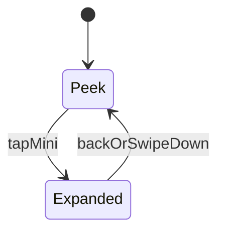
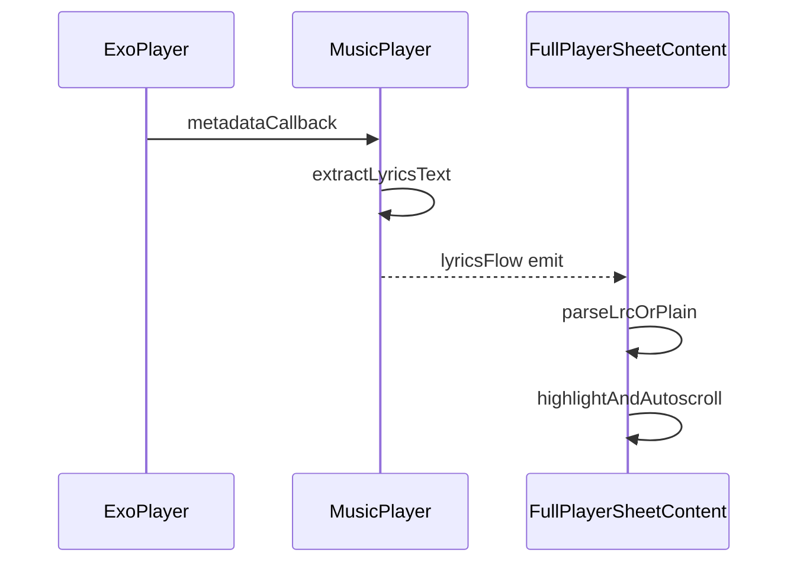

# Apple Music-like Player UI Plan (Union Music Player)

## Goals

- Fix mini player overlap: mini player must sit above the bottom tab bar and never be hidden.
- Fix ugly expansion: mini player should not remain visible when the full player is expanded.
- Mimic Apple Music look: blurred, translucent glass surfaces which feel dynamic.
- Full screen player has 2 swipe pages: album art and lyrics.
- Lyrics come from embedded metadata, show timed highlight when timestamps exist.

## Current State Summary

- Bottom sheet is hosted in `UnionMusicApp` via `BottomSheetScaffold`.
- Mini player UI is `FloatingPlayer`.
- Expanded UI is `FullPlayerSheetContent` which already has an album-art blurred backdrop.
- Current issue: the sheet itself can cover the bottom tab bar, and the sheet content stacks mini + full together.

## Target UX Behavior

### Bottom Sheet states

- Peek state
  - Bottom tab bar visible.
  - Mini player visible above the tab bar.
  - Sheet background is translucent + blurred.

- Expanded state
  - Bottom tab bar hidden.
  - Full player visible, mini player hidden.
  - Full player background uses album art + blur + gradient, and glass surfaces for controls.

### Swipe pages in expanded player

- Page 0: album art page
  - Shows large album art and metadata.

- Page 1: lyrics page
  - Shows lyrics.
  - If lyrics text contains LRC timestamps, highlight current line and auto-scroll.
  - If no timestamps, show plain lyrics with no syncing.

## Architecture Decisions

### Fixing overlap with bottom tab bar

Use animated bottom padding on the bottom-sheet host:

- When peek: push the sheet upward by the tab bar height so the mini player sits above it.
- When expanded: animate padding to zero so the sheet reaches the bottom edge.

This keeps the tab bar unchanged and matches Apple Music behavior.

### Fixing ugly expansion

Make sheet content mutually exclusive:

- Peek: render only mini player content.
- Expanded: render only full player content.

Optional: fade/size transition between the two to avoid a jump.

### Blur and glass surfaces

- Keep the existing album art blur backdrop as a guaranteed fallback.
- Add a true blur library for glass surfaces inside the sheet.
- Apply blur only to the player sheet surfaces, not the tab bar.

## Lyrics Strategy (Embedded Metadata)

### Source

Prefer extracting lyrics from playback metadata instead of scanning files:

- Add a new `lyricsFlow` to `MusicPlayer`.
- In `MusicPlayer`, listen to ExoPlayer metadata callbacks and extract lyrics frames when present.

### Parsing + syncing

- Detect whether lyrics look like timed LRC by searching for timestamp patterns like:
  - `[mm:ss]` or `[mm:ss.xx]`

- If timed:
  - Parse into a list of (timeMs, text).
  - Choose active line via binary search on currentPosition.
  - Auto-scroll to keep active line near the center.
  - Add manual scroll cooldown:
    - If user scrolls, pause auto-scroll.
    - Resume auto-scroll only after a short idle period.

- If plain:
  - Render the text as paragraphs/lines.

## Implementation Plan (File-level)

1. Update sheet host padding and sheet container transparency in `UnionMusicApp`.
2. Update sheetContent composition so peek renders mini only and expanded renders full only.
3. Add Haze dependency and hook a shared blur state near the root content.
4. Refactor `FloatingPlayer` to:
   - Render album art thumbnail.
   - Use translucent blurred glass surface.
   - Add subtle progress indicator.
5. Refactor `FullPlayerSheetContent` to:
   - Add a 2-page horizontal swipe area.
   - Keep progress slider + playback controls persistent.
6. Add lyrics extraction to `MusicPlayer`:
   - Capture and publish embedded lyrics text into `lyricsFlow`.
7. Implement lyrics page UI:
   - Timed highlight + auto-scroll.
   - Plain text fallback.
8. Validate:
   - Peek does not overlap tab bar.
   - Expand/collapse looks smooth.
   - Swipe left shows lyrics.
   - Back collapses from expanded to peek.
   - Blur falls back safely on older devices.

## State Diagram

## Metadata to UI Flow

