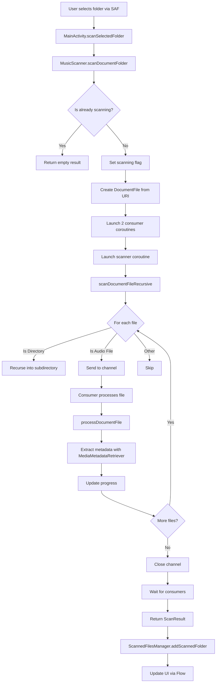

# Fix File Scanning Issues - Plan

## Problem Summary

The user reported multiple issues with the file scanning functionality:
1. **"Scanning Folder..." dialog shows no progress bar** - The dialog pops up but nothing happens
2. **"No folder Added" in Files tab** - After selecting a folder, it shows "no audio files"
3. **Library tab shows "No Music Files"** - Scanned files don't appear in the library
4. **App crashes after 1 minute with overheating** - Resource-intensive scanning causes crashes

## Root Cause Analysis

### Issue 1: No Progress Bar in Scanning Dialog

**Location:** [`MainActivity.kt`](app/src/main/java/org/bibichan/union/player/ui/MainActivity.kt:159-200)

**Problem:** The `scanSelectedFolder()` method shows a Toast message "Scanning folder..." but there's no actual progress dialog UI component. The method just calls:
```kotlin
Toast.makeText(this, "Scanning folder...", Toast.LENGTH_SHORT).show()
```

The `MusicScanner.scanState` Flow exists but is not being observed in the UI to show progress.

### Issue 2: "No Audio Files" After Scanning

**Location:** [`MusicScanner.kt`](app/src/main/java/org/bibichan/union/player/data/MusicScanner.kt:620-640)

**Problem:** The `scanDocumentFileRecursive()` method does scan subdirectories recursively:
```kotlin
private suspend fun scanDocumentFileRecursive(...) {
    dirCounter.incrementAndGet()
    directory.listFiles().forEach { file ->
        when {
            file.isDirectory -> {
                scanDocumentFileRecursive(file, channel, dirCounter)  // Recursive call exists
            }
            file.isFile -> {
                // ... process file
            }
        }
    }
}
```

However, the issue is likely:
1. **Progress calculation is wrong** - Line 574-576 shows progress as `processed.toFloat() / 100` which doesn't reflect actual file count
2. **No total file count** - The scanner doesn't know how many files exist before scanning, so progress appears stuck

### Issue 3: Library Tab Not Showing Scanned Files

**Location:** [`LibraryViewModel.kt`](app/src/main/java/org/bibichan/union/player/ui/library/LibraryViewModel.kt:103-122)

**Analysis:** The code looks correct - it observes `scannedFilesManager.scannedSongs`:
```kotlin
scannedFilesManager.scannedSongs.collect { songs ->
    if (songs.isNotEmpty()) {
        val albumList = withContext(Dispatchers.Default) {
            Album.fromSongs(songs)
        }
        _albums.value = albumList
    }
}
```

The issue is that if scanning fails or returns empty results, the library will be empty.

### Issue 4: App Crashes and Overheating

**Location:** [`MusicScanner.kt`](app/src/main/java/org/bibichan/union/player/data/MusicScanner.kt:562-583)

**Problem:** The scanner uses 4 parallel consumer coroutines plus the main scanning coroutine:
```kotlin
val consumers = List(4) { consumerId ->
    launch {
        for (file in fileChannel) {
            val metadata = processDocumentFile(file, context)  // Heavy operation
        }
    }
}
```

Each `processDocumentFile()` call:
1. Creates a new `MediaMetadataRetriever` instance
2. Reads the entire file to extract metadata
3. Decodes embedded album art
4. Does NOT release resources properly in all error paths

**Critical Issues:**
1. `MediaMetadataRetriever.release()` is called but not in a `finally` block
2. Album art decoding creates full-size Bitmaps which consume large memory
3. No batch processing or throttling - all files are processed as fast as possible
4. No memory pressure detection

## Proposed Solutions

### Solution 1: Add Progress Dialog with Real Progress

**Changes needed:**
1. Create a `ScanningProgressDialog` composable that observes `MusicScanner.scanState`
2. Show actual progress: "Scanning... X files found"
3. Add cancel button to stop scanning

### Solution 2: Fix Progress Calculation

**Changes needed:**
1. First pass: Count total files to scan (quick directory traversal)
2. Second pass: Process files with accurate progress
3. Or use indeterminate progress with file count display

### Solution 3: Optimize Scanning Performance

**Changes needed:**
1. **Reduce parallelism** - Use 2 consumers instead of 4
2. **Add throttling** - Add small delay between file processing
3. **Fix resource leaks** - Use `try-finally` for `MediaMetadataRetriever`
4. **Optimize album art** - Don't decode full-size bitmaps, skip or use thumbnails
5. **Add memory checks** - Monitor memory pressure and pause if needed
6. **Batch processing** - Process files in batches with breaks

### Solution 4: Improve Error Handling

**Changes needed:**
1. Add proper error logging
2. Show user-friendly error messages
3. Handle SAF permission issues

## Implementation Plan

### Phase 1: Fix Critical Issues (Crash and Resource Usage)

1. **Fix `processDocumentFile()` resource management:**
   - Use `try-finally` for `MediaMetadataRetriever.release()`
   - Skip album art extraction during initial scan (load on demand)
   - Add timeout for metadata extraction

2. **Reduce parallelism:**
   - Change from 4 consumers to 2 consumers
   - Add cooperative cancellation checks

3. **Add memory management:**
   - Check available memory before processing
   - Trigger GC hints when memory is low
   - Skip files that are too large

### Phase 2: Add Progress UI

1. **Create `ScanningProgressDialog.kt`:**
   - Observe `MusicScanner.scanState`
   - Show files scanned count
   - Add cancel button

2. **Update `MainActivity.kt`:**
   - Show progress dialog during scan
   - Handle scan completion
   - Handle scan errors

### Phase 3: Improve User Experience

1. **Add two-pass scanning:**
   - First pass: Quick count of audio files
   - Second pass: Process with accurate progress

2. **Add scan results summary:**
   - Show number of files found
   - Show number of errors
   - Allow user to retry failed files

## Code Changes Summary

| File | Change |
|------|--------|
| `MusicScanner.kt` | Fix resource leaks, reduce parallelism, add throttling, skip album art |
| `MainActivity.kt` | Add progress dialog, observe scan state |
| `ScanningProgressDialog.kt` | New file - progress UI component |
| `ScannedFilesManager.kt` | Add error tracking |
| `LibraryViewModel.kt` | No changes needed - already correct |

## Mermaid Diagram: Scanning Flow



## Testing Checklist

- [ ] Select folder with nested subdirectories - verify all files are found
- [ ] Select large folder - verify no crash after 1 minute
- [ ] Monitor memory usage during scan
- [ ] Verify progress dialog shows and updates
- [ ] Verify Library tab shows scanned files
- [ ] Verify Files tab shows folder and files
- [ ] Test cancel button during scan
- [ ] Test with various audio formats: MP3, FLAC, M4A, WAV, OGG, AAC
