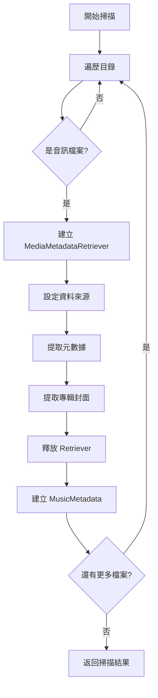

# 遷移計劃：使用 Media3 ExoPlayer 提取音訊元數據

## 問題摘要

Gradle 建置失敗，無法找到以下依賴：
- `io.coil-kt:coil-compose:3.0.4` - 版本不存在
- `com.github.jaudiotagger:jaudiotagger:v3.0.1` - 套件無法解析

**根本原因**：[`MusicScanner.kt`](app/src/main/java/org/bibichan/union/player/data/MusicScanner.kt) 仍使用 `jaudiotagger` 套件，但該套件已從 `build.gradle.kts` 移除。

## 解決方案

使用 Android Media3 ExoPlayer 的 `MediaMetadataRetriever` 來提取音訊元數據，完全替代 jaudiotagger。

## 技術方案

### Media3 元數據提取方式

Media3 提供兩種主要方式提取元數據：

#### 方式一：使用 Media3 的 MediaMetadata（推薦）

```kotlin
import androidx.media3.common.MediaMetadata
import androidx.media3.exoplayer.ExoPlayer

// 透過 ExoPlayer 的 MediaMetadata 獲取元數據
// 適合已經使用 ExoPlayer 播放的場景
```

#### 方式二：使用 Android MediaMetadataRetriever（適合掃描場景）

```kotlin
import android.media.MediaMetadataRetriever

val retriever = MediaMetadataRetriever()
retriever.setDataSource(filePath)

val title = retriever.extractMetadata(MediaMetadataRetriever.METADATA_KEY_TITLE)
val artist = retriever.extractMetadata(MediaMetadataRetriever.METADATA_KEY_ARTIST)
val album = retriever.extractMetadata(MediaMetadataRetriever.METADATA_KEY_ALBUM)
val duration = retriever.extractMetadata(MediaMetadataRetriever.METADATA_KEY_DURATION)
val genre = retriever.extractMetadata(MediaMetadataRetriever.METADATA_KEY_GENRE)
val year = retriever.extractMetadata(MediaMetadataRetriever.METADATA_KEY_YEAR)
val trackNumber = retriever.extractMetadata(MediaMetadataRetriever.METADATA_KEY_CD_TRACK_NUMBER)

// 提取專輯封面
val albumArt = retriever.embeddedPicture

retriever.release()
```

### 優勢比較

| 特性 | jaudiotagger | MediaMetadataRetriever |
|------|--------------|------------------------|
| 維護狀態 | 已停止維護 | Android 官方 API |
| Android 相容性 | 有 javax.swing 依賴問題 | 原生支援 |
| Hi-Res 音訊支援 | 有限 | 支援 FLAC、ALAC 等 |
| 專輯封面提取 | 支援 | 支援 |
| 播放功能 | 無 | 與 ExoPlayer 整合 |

## 實作計劃

### 步驟 1：更新 MusicScanner.kt

**檔案**：[`app/src/main/java/org/bibichan/union/player/data/MusicScanner.kt`](app/src/main/java/org/bibichan/union/player/data/MusicScanner.kt)

**變更內容**：

1. 移除 jaudiotagger import：
   ```kotlin
   // 移除
   import org.jaudiotagger.audio.AudioFileIO
   import org.jaudiotagger.tag.FieldKey
   ```

2. 新增 MediaMetadataRetriever import：
   ```kotlin
   import android.media.MediaMetadataRetriever
   import android.graphics.BitmapFactory
   ```

3. 重構 `processAudioFile()` 函數（第 175-224 行）：
   ```kotlin
   private fun processAudioFile(file: File): MusicMetadata? {
       return try {
           val extension = file.extension.lowercase()
           val format = AudioFormat.fromExtension(extension)

           if (format == AudioFormat.UNKNOWN) {
               return null
           }

           val retriever = MediaMetadataRetriever()
           retriever.setDataSource(file.absolutePath)

           // 提取元數據
           val title = retriever.extractMetadata(MediaMetadataRetriever.METADATA_KEY_TITLE)
               ?.takeIf { it.isNotBlank() } ?: file.nameWithoutExtension
           val artist = retriever.extractMetadata(MediaMetadataRetriever.METADATA_KEY_ARTIST)
               ?.takeIf { it.isNotBlank() } ?: "Unknown Artist"
           val album = retriever.extractMetadata(MediaMetadataRetriever.METADATA_KEY_ALBUM)
               ?.takeIf { it.isNotBlank() } ?: "Unknown Album"
           val genre = retriever.extractMetadata(MediaMetadataRetriever.METADATA_KEY_GENRE)
               ?.takeIf { it.isNotBlank() }
           val year = retriever.extractMetadata(MediaMetadataRetriever.METADATA_KEY_YEAR)?.toIntOrNull()
           val trackNumber = retriever.extractMetadata(MediaMetadataRetriever.METADATA_KEY_CD_TRACK_NUMBER)?.toIntOrNull()

           // 提取時長（毫秒）
           val duration = retriever.extractMetadata(MediaMetadataRetriever.METADATA_KEY_DURATION)?.toLongOrNull() ?: 0L

           // 提取專輯封面
           val albumArt = extractAlbumArt(retriever)

           retriever.release()

           MusicMetadata(
               id = System.nanoTime(),
               title = title,
               artist = artist,
               album = album,
               duration = duration,
               filePath = file.absolutePath,
               uri = Uri.fromFile(file),
               albumArt = albumArt,
               genre = genre,
               year = year,
               trackNumber = trackNumber,
               format = format
           )
       } catch (e: Exception) {
           Log.e(TAG, "Error processing file: ${file.name}", e)
           null
       }
   }
   ```

4. 重構 `extractAlbumArt()` 函數（第 245-259 行）：
   ```kotlin
   private fun extractAlbumArt(retriever: MediaMetadataRetriever): android.graphics.Bitmap? {
       return try {
           val imageData = retriever.embeddedPicture
           if (imageData != null) {
               BitmapFactory.decodeByteArray(imageData, 0, imageData.size)
           } else {
               null
           }
       } catch (e: Exception) {
           Log.w(TAG, "Error extracting album art", e)
           null
       }
   }
   ```

### 步驟 2：確認 build.gradle.kts 依賴

**檔案**：[`app/build.gradle.kts`](app/build.gradle.kts)

目前配置已正確：
- Coil 使用 `2.7.0` 版本（穩定版）
- Media3 ExoPlayer 使用 `1.5.1` 版本
- 已移除 jaudiotagger 依賴

無需修改。

### 步驟 3：清理 Gradle 快取

執行以下命令清理舊的建置快取：

```bash
./gradlew clean
./gradlew build --refresh-dependencies
```

## 流程圖



## 驗證清單

- [ ] MusicScanner.kt 不再 import jaudiotagger
- [ ] 使用 MediaMetadataRetriever 提取元數據
- [ ] 正確提取標題、藝術家、專輯等資訊
- [ ] 正確提取專輯封面圖片
- [ ] 正確提取音訊時長
- [ ] 正確處理 FLAC、ALAC 等 Hi-Res 格式
- [ ] Gradle 建置成功
- [ ] 應用程式正常運行

## 注意事項

1. **MediaMetadataRetriever 支援的格式**：
   - MP3、FLAC、M4A、AAC、WAV、OGG 等主流格式
   - 與專案定義的 `AudioFormat` enum 一致

2. **錯誤處理**：
   - 某些檔案可能沒有完整的元數據
   - 使用 `?.takeIf { it.isNotBlank() }` 處理空值

3. **效能考量**：
   - `MediaMetadataRetriever` 需要讀取整個檔案頭部
   - 已使用協程並行處理，效能應可接受

4. **資源釋放**：
   - 務必呼叫 `retriever.release()` 釋放資源
