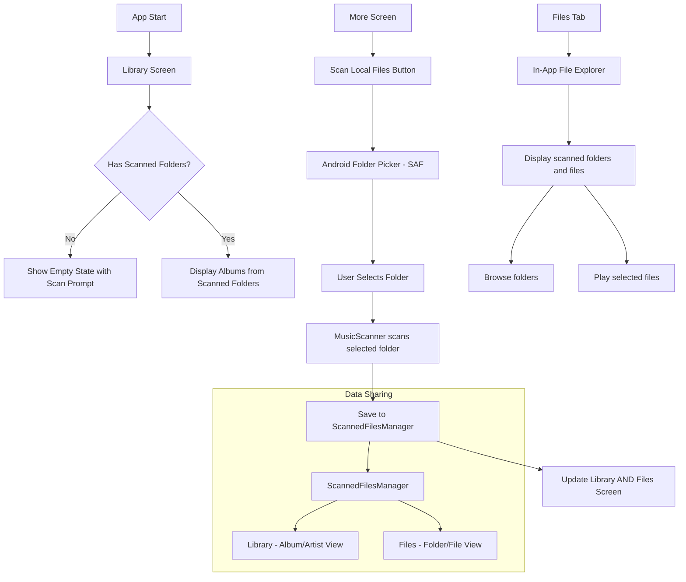
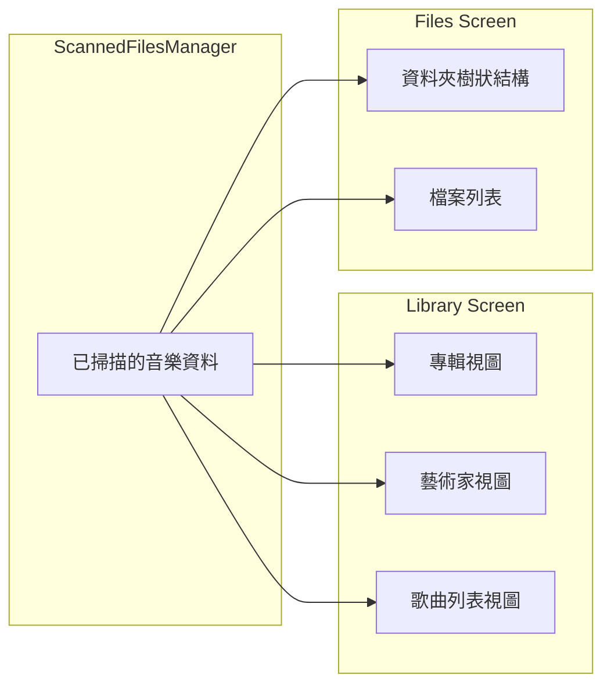
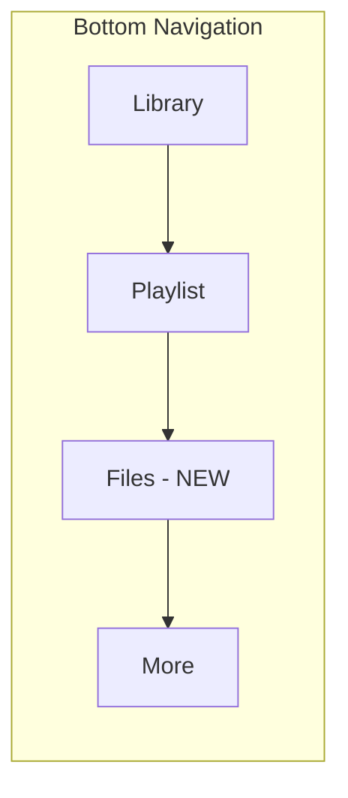
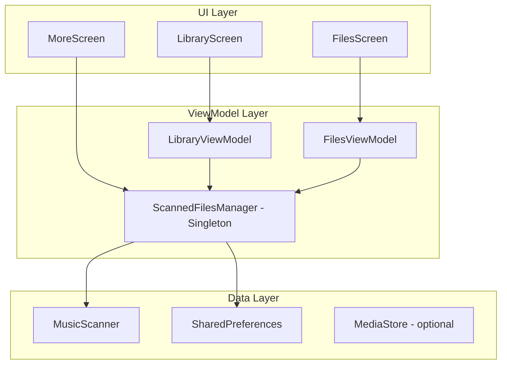

# 掃描資料夾選擇與檔案瀏覽器功能設計

## 需求概述

1. **取消自動掃描**：應用啟動時不再自動掃描整個內部存儲
2. **資料夾選擇掃描**：在 "Scan Local Files" 按鈕中使用 Android 內建的資料夾選擇工具
3. **新增 Files 標籤頁**：在底部導航欄新增第 4 個按鈕，位於 Playlist 右側
4. **應用內檔案瀏覽器**：Files 標籤頁顯示已掃描的本地檔案，使用 Material 3 設計
5. **Library 顯示掃描內容**：Library 頁面也會顯示已掃描的音樂，以專輯/藝術家形式呈現

## 架構設計

### 1. 整體流程圖



### 1.1 Library 與 Files 的關係



**兩個頁面的區別：**
- **Library**：以專輯、藝術家、歌曲等音樂元數據視角呈現，適合瀏覽和發現音樂
- **Files**：以檔案系統視角呈現，顯示實際的資料夾結構和檔案，適合管理檔案

### 2. 底部導航更新



### 3. 資料流架構



## 詳細設計

### 4. 新增/修改的檔案

| 檔案 | 操作 | 說明 |
|------|------|------|
| `ScannedFilesManager.kt` | 新增 | 管理已掃描資料夾的單例類 |
| `FilesScreen.kt` | 新增 | 應用內檔案瀏覽器 UI |
| `FilesViewModel.kt` | 新增 | 檔案瀏覽器的 ViewModel |
| `LibraryViewModel.kt` | 修改 | 移除自動掃描，改為從 ScannedFilesManager 獲取數據 |
| `MoreScreen.kt` | 修改 | 使用 SAF 選擇資料夾並觸發掃描 |
| `UnionMusicApp.kt` | 修改 | 新增 Files 標籤頁 |
| `BottomControlPanel.kt` | 修改 | 支援 4 個導航項 |
| `MusicScanner.kt` | 修改 | 支援從 DocumentFile 掃描 |

### 5. ScannedFilesManager 設計

```kotlin
// 位置: app/src/main/java/org/bibichan/union/player/data/ScannedFilesManager.kt

/**
 * 掃描資料夾資料
 * @param uri 資料夾 URI (來自 SAF)
 * @param name 顯示名稱
 * @param scanTime 掃描時間
 * @param songCount 掃描到的歌曲數量
 */
data class ScannedFolder(
    val uri: Uri,
    val name: String,
    val path: String,
    val scanTime: Long,
    val songCount: Int
)

/**
 * 已掃描檔案管理器
 * - 使用 SharedPreferences 持久化存儲已掃描的資料夾列表
 * - 提供掃描結果的緩存
 */
class ScannedFilesManager(context: Context) {
    // 儲存已掃描的資料夾
    private val _scannedFolders = MutableStateFlow<List<ScannedFolder>>(emptyList())
    val scannedFolders: StateFlow<List<ScannedFolder>> = _scannedFolders
    
    // 緩存掃描結果
    private val _scannedSongs = MutableStateFlow<List<MusicMetadata>>(emptyList())
    val scannedSongs: StateFlow<List<MusicMetadata>> = _scannedSongs
    
    // 按資料夾分組的檔案樹結構
    private val _fileTree = MutableStateFlow<Map<ScannedFolder, List<MusicMetadata>>>(emptyMap())
    val fileTree: StateFlow<Map<ScannedFolder, List<MusicMetadata>>> = _fileTree
    
    fun addScannedFolder(uri: Uri, songs: List<MusicMetadata>)
    fun removeScannedFolder(uri: Uri)
    fun getSongsInFolder(folderUri: Uri): List<MusicMetadata>
    fun refreshAllFolders()
    fun loadFromPreferences()
    fun saveToPreferences()
}
```

### 6. FilesScreen 設計 (Material 3)

```kotlin
// 位置: app/src/main/java/org/bibichan/union/player/ui/screens/FilesScreen.kt

/**
 * 應用內檔案瀏覽器
 * 
 * 功能:
 * - 顯示已掃描的資料夾列表
 * - 點擊資料夾可展開查看內部檔案
 * - 支援檔案/資料夾的層級瀏覽
 * - 點擊音樂檔案可直接播放
 * - Material 3 設計風格
 */
@Composable
fun FilesScreen(
    onSongClick: (MusicMetadata, List<MusicMetadata>, Int) -> Unit,
    modifier: Modifier = Modifier
) {
    // 狀態
    val viewModel: FilesViewModel = viewModel()
    val scannedFolders by viewModel.scannedFolders.collectAsState()
    val currentPath by viewModel.currentPath.collectAsState()
    val currentFiles by viewModel.currentFiles.collectAsState()
    
    Scaffold(
        topBar = {
            TopAppBar(
                title = { Text("Files") },
                navigationIcon = {
                    if (currentPath != null) {
                        IconButton(onClick = { viewModel.navigateUp() }) {
                            Icon(Icons.Default.ArrowBack, "Navigate Up")
                        }
                    }
                }
            )
        }
    ) { paddingValues ->
        if (scannedFolders.isEmpty()) {
            // 空狀態
            EmptyFilesState()
        } else {
            // 檔案列表
            FileListView(
                folders = scannedFolders,
                files = currentFiles,
                onFolderClick = { viewModel.navigateToFolder(it) },
                onFileClick = { song, index -> onSongClick(song, currentFiles, index) }
            )
        }
    }
}
```

### 7. MoreScreen 修改 - 使用 SAF

```kotlin
// 修改 MoreScreen.kt 中的 Scan Local Files 按鈕邏輯

// 在 MainActivity 中添加:
private val folderPickerLauncher = registerForActivityResult(
    ActivityResultContracts.OpenDocumentTree()
) { uri ->
    uri?.let {
        // 用戶選擇了資料夾，開始掃描
        scanSelectedFolder(it)
    }
}

// MoreScreen 中的按鈕:
SettingsItem(
    icon = Icons.Default.FolderOpen,
    title = "Scan Local Files",
    subtitle = "Select a folder to scan for music files",
    onClick = {
        // 啟動資料夾選擇器
        folderPickerLauncher.launch(null)
    }
)
```

### 8. MusicScanner 擴展

```kotlin
// 在 MusicScanner.kt 中添加新方法

/**
 * 掃描 SAF DocumentFile 資料夾
 */
suspend fun scanDocumentFolder(
    folderUri: Uri,
    context: Context
): ScanResult = withContext(Dispatchers.IO) {
    val documentFile = DocumentFile.fromTreeUri(context, folderUri)
    // 遞歸掃描 DocumentFile
    // ...
}
```

### 9. LibraryViewModel 修改

```kotlin
// 移除 init 中的自動掃描
init {
    // 不再自動調用 loadMusicLibrary()
    // 改為觀察 ScannedFilesManager 的數據變化
    observeScannedFiles()
}

/**
 * 觀察 ScannedFilesManager 的變化
 * 當有新的掃描結果時自動更新 Library
 */
private fun observeScannedFiles() {
    viewModelScope.launch {
        scannedFilesManager.scannedSongs.collect { songs ->
            // 將掃描的歌曲轉換為專輯列表
            val albumList = withContext(Dispatchers.Default) {
                Album.fromSongs(songs)
            }
            _albums.value = albumList
            _isLoading.value = false
        }
    }
}

/**
 * 手動刷新（從 ScannedFilesManager 重新獲取）
 */
fun refresh() {
    _isLoading.value = true
    // ScannedFilesManager 的 Flow 會自動觸發更新
}

/**
 * 當沒有掃描任何資料夾時顯示空狀態
 */
val hasScannedFolders: StateFlow<Boolean> = scannedFilesManager.hasScannedFolders
```

### 9.1 LibraryScreen 空狀態處理

```kotlin
// LibraryScreen.kt 中添加空狀態 UI

@Composable
fun LibraryScreen(...) {
    val hasScannedFolders by viewModel.hasScannedFolders.collectAsState()
    
    when {
        !hasPermission -> {
            PermissionRequiredContent(...)
        }
        !hasScannedFolders -> {
            // 顯示空狀態，提示用戶掃描資料夾
            EmptyLibraryState(
                onScanClick = { /* 導航到 More 頁面 */ }
            )
        }
        isLoading -> {
            LoadingContent()
        }
        else -> {
            OptimizedLibraryContent(...)
        }
    }
}

@Composable
fun EmptyLibraryState(onScanClick: () -> Unit) {
    Column(
        modifier = Modifier.fillMaxSize(),
        horizontalAlignment = Alignment.CenterHorizontally,
        verticalArrangement = Arrangement.Center
    ) {
        Icon(
            imageVector = Icons.Default.LibraryMusic,
            contentDescription = null,
            modifier = Modifier.size(80.dp),
            tint = MaterialTheme.colorScheme.outline
        )
        Spacer(modifier = Modifier.height(16.dp))
        Text(
            text = "No Music Found",
            style = MaterialTheme.typography.headlineSmall
        )
        Spacer(modifier = Modifier.height(8.dp))
        Text(
            text = "Scan a folder to add your music",
            style = MaterialTheme.typography.bodyMedium,
            color = MaterialTheme.colorScheme.outline
        )
        Spacer(modifier = Modifier.height(24.dp))
        FilledTonalButton(onClick = onScanClick) {
            Icon(Icons.Default.FolderOpen, contentDescription = null)
            Spacer(modifier = Modifier.width(8.dp))
            Text("Scan Local Files")
        }
    }
}
```

### 10. 底部導航更新

```kotlin
// UnionMusicApp.kt
val navItems = listOf(
    NavItem("library", Icons.Default.LibraryMusic, "Library"),
    NavItem("playlist", Icons.Default.QueueMusic, "Playlist"),
    NavItem("files", Icons.Default.Folder, "Files"),      // 新增
    NavItem("more", Icons.Default.MoreHoriz, "More")
)

// 導航邏輯
when (selectedTab) {
    0 -> LibraryScreen(...)
    1 -> PlaylistManagementScreen(...)
    2 -> FilesScreen(...)   // 新增
    3 -> MoreScreen(...)
}
```

## UI 設計參考

### Files Screen 佈局

```
┌─────────────────────────────────────┐
│  ◀  Files                           │
├─────────────────────────────────────┤
│                                     │
│  📁 Music Folder 1         >        │
│     128 songs                       │
│                                     │
│  📁 Music Folder 2         >        │
│     45 songs                        │
│                                     │
│  📁 Downloads             >         │
│     12 songs                        │
│                                     │
├─────────────────────────────────────┤
│  Library │ Playlist │ Files │ More │
└─────────────────────────────────────┘
```

### 資料夾內容視圖

```
┌─────────────────────────────────────┐
│  ◀  Music Folder 1                  │
├─────────────────────────────────────┤
│                                     │
│  📁 Subfolder 1            >        │
│                                     │
│  📁 Subfolder 2            >        │
│                                     │
│  🎵 Song 1.mp3                      │
│     Artist • 3:45                   │
│                                     │
│  🎵 Song 2.flac                     │
│     Artist • 4:12                   │
│                                     │
├─────────────────────────────────────┤
│  Library │ Playlist │ Files │ More │
└─────────────────────────────────────┘
```

## 實現順序

1. **Phase 1: 基礎架構**
   - 創建 `ScannedFilesManager`
   - 修改 `MusicScanner` 支援 DocumentFile

2. **Phase 2: 資料夾選擇**
   - 修改 `MainActivity` 添加 folder picker launcher
   - 修改 `MoreScreen` 使用 SAF

3. **Phase 3: 檔案瀏覽器**
   - 創建 `FilesViewModel`
   - 創建 `FilesScreen`

4. **Phase 4: 導航整合**
   - 修改 `BottomControlPanel`
   - 修改 `UnionMusicApp`

5. **Phase 5: Library 整合**
   - 修改 `LibraryViewModel`
   - 確保 Library 顯示掃描的內容

## 注意事項

1. **權限處理**：SAF 不需要額外權限，用戶選擇資料夾時會自動授予臨時訪問權限
2. **持久化權限**：需要調用 `contentResolver.takePersistableUriPermission()` 來保持訪問權限
3. **性能優化**：大型資料夾掃描需要顯示進度，使用協程避免阻塞 UI
4. **錯誤處理**：處理資料夾不存在、權限被撤銷等情況
